# Respuestas primer parcial Sistemas Operativos II

## Preguntas Active Directory Domain Services:

1. 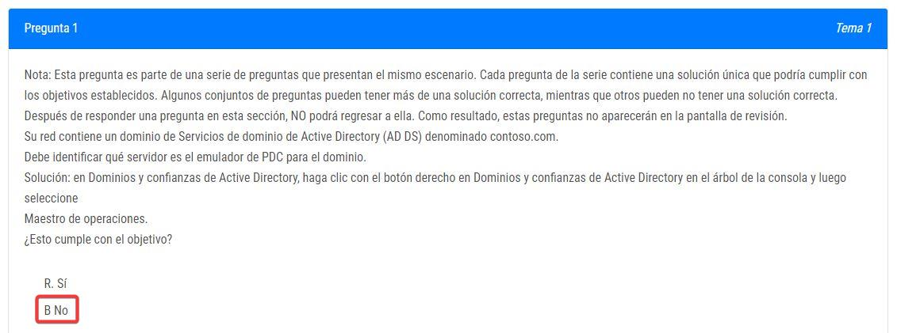
2. 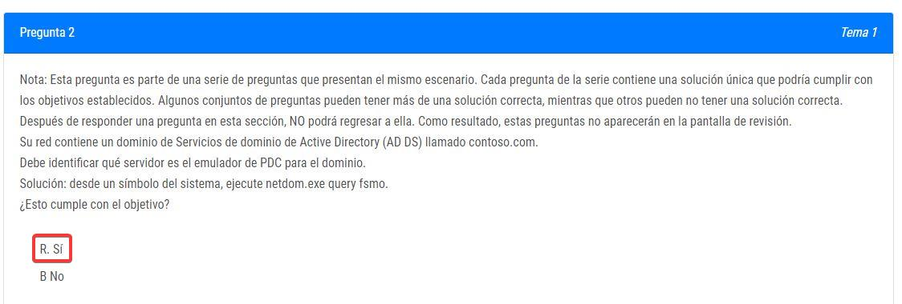
3. 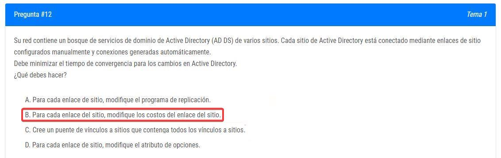
4. 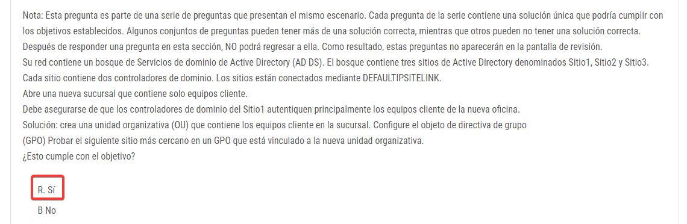
-> [Más información de Microsoft](https://learn.microsoft.com/es-es/windows-server/identity/ad-ds/plan/delegating-administration-of-default-containers-and-ous) [Más información del resumen](README.md#Unidad\Organizativa)
5. 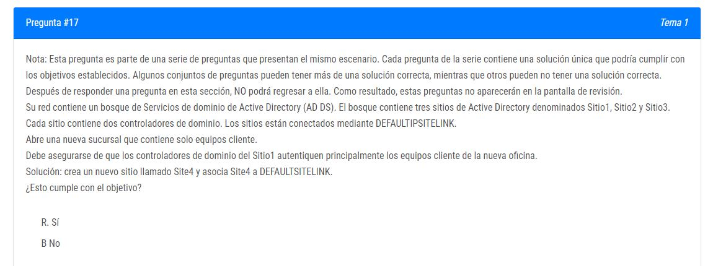
6. 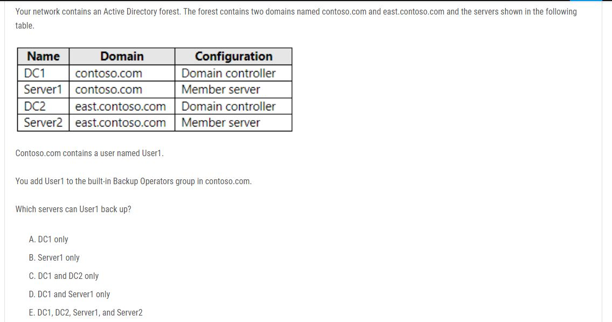

## Preguntas DHCP:

7. 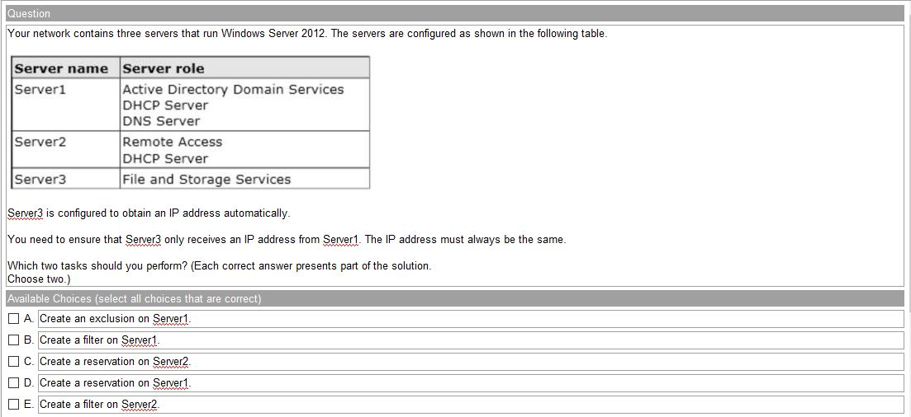
8. 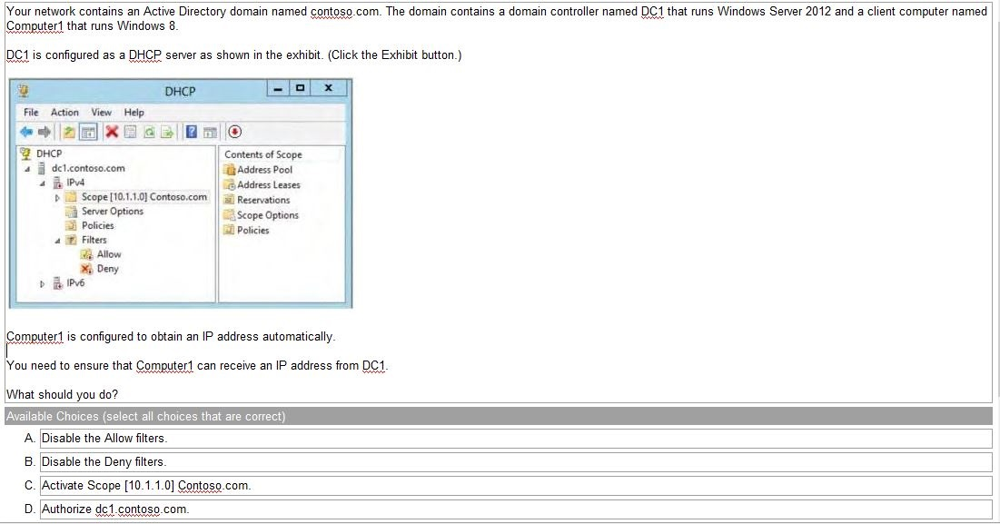
9. 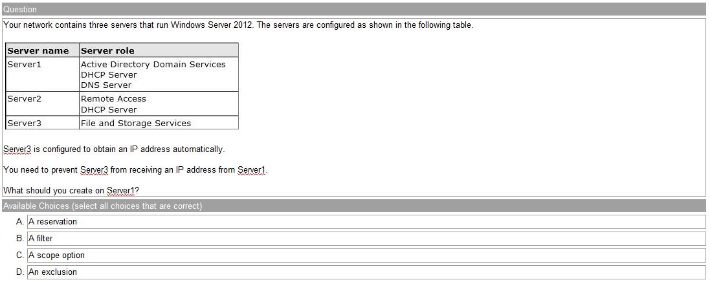
10. 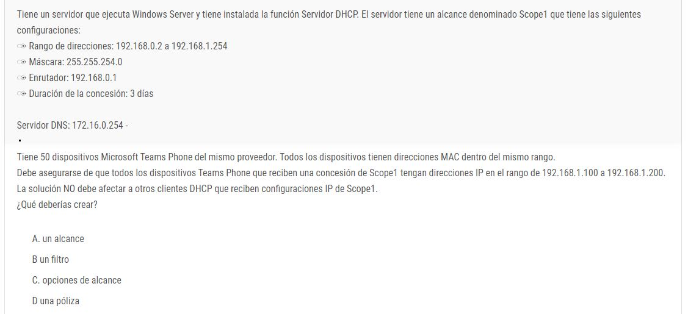

## Preguntas DNS:

11. 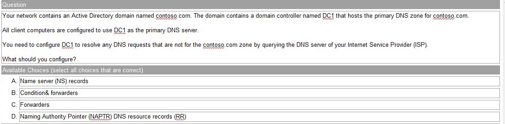
12. 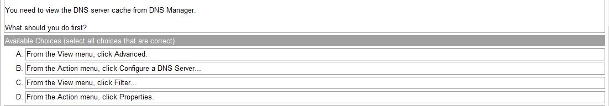
13. 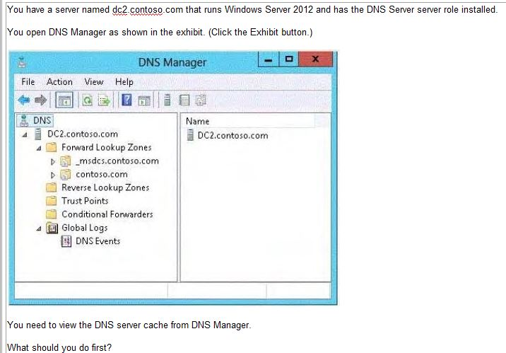

## Preguntas Group Policy Object:

14. 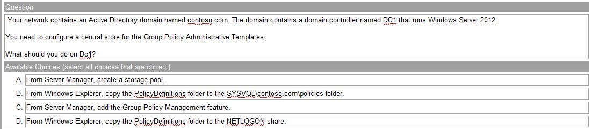

## Preguntas Hyper-V:

15. 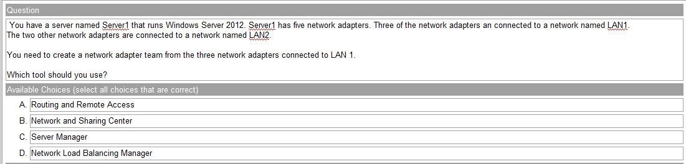
16. 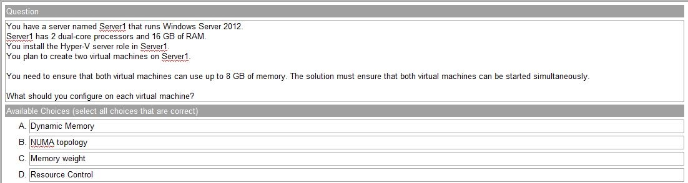
17. 
18. 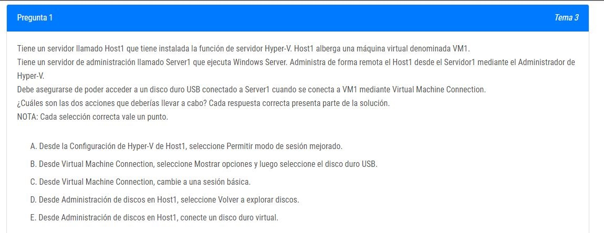
