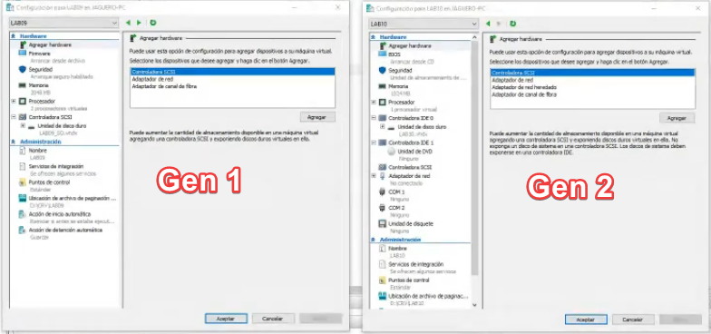
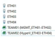
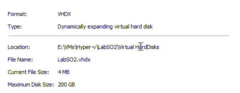
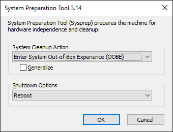
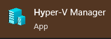

# Resumen de Sistemas Operativos II

[Primer Parcial](./PrimerParcial.md)
### Conceptos básicos Hyper-V

#### Generación

Diferencia entre Generación 1 y Generación 2 de máquinas virtuales Hyper-V:

* Gen 1 estaba en versiones de Windows Server 2008 R2
* Gen 2 sale a partir de Windows Server 2012
* Difieren en el firmware que manejan (Gen1 BIOS, no Hot Swap, usa controladora de discord IDE/ Gen2 UEFI, con Hot Swap, usa controladora de discord SCSI) por lo tanto la Gen2 posee más opciones de configuración
* 
* Se conservan ambas generaciones por compatibilidad

#### Sesión mejorada

* Se activa haciendo click derecho sobre el host (arriba a la izquierda) -> Configuración de Hyper-V -> Activar el checkbox de sesión mejorada
* Permite funciones como ajuste dinámico de la resolución, portapapeles compartido, entre otras funcionalidades

#### Versión de configuración

* En base al Host, cuándo se crea la máquina virtual, las características que posee en ese momento (Por ejemplo teniendo Windows 10 actualizado al crear una máquina virtual se le asigna la versión 9.0)

#### Virtualización anidada

* Se consigue instalando el rol de Hyper-V a una máquina virtual
* Se necesita habilitar la virtualización anidada en el Host (por cada máquina virtual)
* La máquina virtual debe estar apagada, debe poseer Windows 10 o Windows Server 2016 en adelante
* Se habilita con el siguiente comando en el Host utilizando Powershell:
```
Set-VMProcessor -VMName <NombreDeLaVM> -ExposeVirtualizationExtensions $true
```
* Se habilita el rol de Hyper-V desde Server Manager
* Seleccionar un protocolo (es necesario seleccionar un protocolo utilizado en Live Migration que se utilice en ambos __nodos__, Host, Hipervisor o Servidor Físico, aunque se puede editar a posterior)
* Seleccionar una ubicación dónde se alojan los .vhdx y las VMs

#### Nodo

Se le denomina a:
* Servidor físico
* Hipervisor
* Host

#### Exportar/Importar VMs

* Eficaz para mover VMs a otra organización fuera del dominio (por ejemplo guardándola en un disco duro externo)
* Puede utilizarse dentro de un mismo Hyper-V para generar un ambiente de #desarrollo con las mismas librerías/dependencias
* Al __importar__ desde el mismo hipervisor, no se puede registrar o restaurar la VM ya que posee el mismo número de ID. Se debe copiar la VM a fin de crear un nuevo número de ID

#### Live Migration

Movimiento en caliente
* Deben estar unidas al mismo dominio
* Eficaz para mover de un [nodo](#Nodo) a otro conectado un por switch de alta velocidad

#### Memoria Virtual

Memoria (RAM)
* Memoria de inicio: Memoria con la que inicia la máquina virtual (lo que reserva en el Host)
* Memoria dinámica: Utiliza memoria a demanda (por ejemplo usa 1GB y no el límite considerado en Memoria de inicio)
* Memoria fija: Reserva toda la memoria asignada en Memoria de inicio
* Microsoft sugiere que en equipos de #producción se le asigne memoria fija y memoria dinámica se use para entornos de #desarrollo

#### APIPA

* Asignación Automática de Direcciones IP Privadas (APIPA, por su sigla en inglés)
* Los clientes DHCP configuran automáticamente una dirección IP y una máscara de red secundaria cuando no está disponible un servidor DHCP
* El dispositivo se asigna su propia dirección IP en el rango 169.254.1.0 a 169.254.254.255

#### NIC

* Del inglés __Network Interface Controller__ 
* También conocida como tarjeta de red, placa de red, adaptador de red, adaptador LAN, Interfaz de red física

#### NIC Teamming

* Utilizar dos o más NIC físicas como una sola placa virtual
* Las placas pierden administración individual y la que se debe administrar es la placa virtual del teamming
* Los anchos de banda de suman
* Genera una MAC address diferente a las físicas
* Útil para utilizar todo el ancho de banda físico de nuestro servidor y para no perder la conexión (IP por Remote Desktop Protocol) en el caso de querer cambiar o en el caso de un eventual fallo de alguna NIC física
* Útil en ambientes de #producción 
* En administrador de conmutadores virtuales, se puede seleccionar que no cree una NIC virtual (en el Host) cuando se crea el virtual switch externo (se muestra sólo el teamming y no el adaptador de vEthernet por lo tanto quedaría el teamming dedicado a Hyper-V)
* 

#### Conmutadores de red virtualizados

* Existen 4 tipos:
	* Privado: Permite que las máquinas virtuales se comuniquen entre sí pero no admite conexión entre el Host y el Invitado. Pensado para habientes de #desarrollo 
	* Interno: Igual que el privado pero admite la conexión entre el Host (creando una placa virtual en el mismo) e Hyper-V siempre y cuando estén en la misma subred. Pensado para habientes de #desarrollo  
	* Externo: Igual que el interno pero necesita utilizar una [placa física](#NIC) para conectarse. Al crear el adaptador virtual, el [adaptador interno](#NIC) (físico) pierde el poder de administración y el que se debe administrar es el virtual (tal cual como si fuese un [adaptador](#NIC) de Red físico).
	* Default Switch: Conmutador por defecto

#### Discos Virtuales

* Se almacena en un archivo con extensión .vhdx o .vhd
* Diferencia entre .vhdx y .vhd:
	* .vhdx se encuentra a partir de Windows Server 2012, se puede crear discos virtuales hasta 64TB y Microsoft dice que es menos propenso a errores
	* .vhd se encuentra hasta Windows Server 2008R2, se puede crear discos virtuales hasta 2TB
* Se puede convertir de .vhd a .vhdx
* Se dividen en 3 categorías:
	* Dinámicos: Se le asigna el total en GB pero sólo utiliza la cantidad (espacio) de datos que tiene almacenado, para entornos de #desarrollo se puede convertir a fijo.
		
	
	* Fijos: Se le asigna el total en GB y el tamaño del archivo que se crea es de esa cantidad
	* Diferenciados/secundario (sólo para ambientes de #desarrollo ya que si se cae o rompe el disco primario, también se rompe el secundario): Posee un disco duro primario ([template](#Disco\virtual\Template\o\Plantilla)) referenciado y usa su propio .vhdx para alojar las diferencias (por ejemplo el primario posee el sistema operativo y el secundario un aplicativo como SQL) 
* Se agregan al crear la máquina virtual o desde configuración en el apartado de Controladora SCSI

#### Disco virtual Template o Plantilla

Disco template/plantilla de [Sistema Operativo](#Sistema\Operativo)
* Debe poseer un nombre descriptivo (por ejemplo: TemplateWS2021CoreEs_Dynamic.vhdx)
* Debe tener un SID diferente (debe ejecutarse sysprep.exe en el equipo a exportar -> clickear en generalize -> y seleccionar la opción de shutdown -> copiar el .vhdx)

#### Sistema Operativo

* Se descarga desde [Microsoft](https://www.microsoft.com/es-ES/evalcenter/evaluate-windows-server-2022) en formato .ISO
* Se agregan al crear la máquina virtual o desde configuración en el apartado de Controladora SCSI, en unidades de DVD, imagen .ISO
* Vienen en dos ediciones (la cual se elije en la instalación y no se puede cambiar):
	* Sin interfaz gráfica (Línea de comandos)
	* Experiencia de escritorio (Con interfaz gráfica)

#### SID

* En sistemas operativos Microsoft Windows NT, un __Identificador de seguridad (o del inglés Security IDentifier)__ es un identificador único e inmutable de un usuario, grupo de usuarios u otro director de seguridad
* El ejecutable C:\\windows\\system32\\sysprep\\sysprep.exe borra archivos de configuración para poder exportar la máquina y usarla como [template](#Disco\virtual\Template\o\Plantilla)
*  

#### Snapshot

* Es una imagen del sistema operativo en un momento dado
* Se puede, una vez instalado el sistema operativo, crear una snapshot a fin de evitar un posible error al instalar una aplicación
* Crea un archivo .avhdx que aloja las diferencias
* Sólo se recomienda en entornos de #desarrollo ya que baja el rendimiento al tener que recorrer el .vhdx original y el .avhdx con las diferencias
* Se puede eliminar el snapshot una vez que se verificó que funciona todo correctamente (necesario en entornos de #producción ) para dejar un único archivo .vhdx y mejorar el rendimiento (puede tardar si posee muchos snapshots o si es muy grande)
* Los Snapshot __NO SON UN BACKUP__
* A partir de la versión de configuración 9 vienen activados los snapshots automáticos

#### Creación de máquinas virtuales

* Luego de habilitar la característica de Hyper-V en Windows abrir Hyper-V manager:
* 
* Click derecho sobre host (mi PC arriba a la izquierda) -> Nuevo -> Máquina virtual
* Poner nombre a nuestra máquina virtual
* Clickear checkbox para almacenar la máquina virtual en otra ubicación (se recomienda no dejarlo en el disco local C:\\ )
* Seleccionar la [Generación](#Generación)
* Se le asigna un espacio de [memoria](#Memoria\Virtual) (RAM)
* Se le asigna un [adaptador](#Conmutadores\de\red\virtualizados) de red
* Se le asigna un [disco](#Discos\Virtuales) duro virtual
* Finalizar (Posteriormente se le debe agregar un [sistema operativo](#Sistema\Operativo) para que arranque)

#### Inicio automático

* Determina si la máquina virtual se inicia automáticamente cuando se encienda el Host
* Se puede retrasar el inicio (útil en ambientes de #producción por ejemplo para controladores de dominio)

#### Detención automática

* Determina el comportamiento de la máquina virtual cuando se apaga el Host
* Por defecto guarda el estado en el que está (con sus programas abiertos)
* Pensado para ambientes de #desarrollo 
* En #producción se utiliza la opción de Apagar el sistema operativo invitado

#### Actualizar Windows Server

* Hacer un backup del disco original
* Descargar la ISO, una versión más nueva de la actual, se debe instalar una versión más nueva a la vez
* Montar la ISO como DVD en la VM
* Marcar la opción upgrade

#### Herramienta Veeam backup and restore

* Veeam Software es una empresa privada del sector de la tecnología de la información que desarrolla software de gestión de backup, recuperación ante desastres y gestión inteligente de datos para infraestructuras virtuales, físicas y multi-cloud

### Active directory

[Active Directory](https://learn.microsoft.com/es-es/windows/win32/ad/active-directory-domain-services) (AD) o Directorio Activo (DA) son los términos que utiliza Microsoft para referirse a su implementación de servicio de directorio en una red distribuida de computadoras. Utiliza distintos protocolos, principalmente LDAP, DNS,​ DHCP y Kerberos.

De forma sencilla se puede decir que es un servicio establecido en uno o varios servidores en donde se crean objetos tales como usuarios, equipos o grupos, con el objetivo de administrar los inicios de sesión en los equipos conectados a la red, así como también la administración de políticas en toda la red.

#### Nivel funcional

* Según el sistema operativo que posea el controlador de dominio
* Siempre elegir el más reciente
* Aunque tengas una versión más nueva, a veces dice una versión anterior, eso es porque Microsoft no sacó ninguna actualización de AD en las nuevas versiones

#### Bosque

Conjunto de todos los dominios (root y child domains)


#### Child Domain

* Agregar un nuevo dominio a un bosque existente
* Hereda el sufijo del padre por ejemplo ```adm.nombrempresa.local```
* También necesita contra dominios
* __Tiene sus propios objetos__
* Si no es por algo político organizacional o comercial no se crean child domain
* Se utiliza por ejemplo para que administrar distintas filiales con distintos administradores

#### Domain

* Le suelen dar el mismo nombre que la organización
* Debe contener por lo menos dos etiquetas (```.com.ar``` ```.local``` ```.internal```)
* Antes Microsoft recomendaba dominios ```.local .internal```, ahora recomienda enroutables ```.com .com.ar```
* Permite establecer políticas de grupo (controla los USB, no se puede abrir el panel de control, establecer un fondo de escritorio para todos)
* Posee una consola centralizada (por ejemplo para crear usuarios que puedan iniciar sesión en cualquier equipo del dominio)
* Server Manager -> Usuarios y equipos de Active Directory -> Consola centralizada
* Instalar el rol de Active Directory Domain Services (ADDS) y configurarlo (promoverlo a controlador de dominio)
* En versiones anteriores a la __Windows Server 2008R2__ tenías que ejecutar el comando ```dcpromo``` , a partir de la versión 2012 ese comando se __descontinuo__ y ahora se hace desde __Server Manager__ posterior a instalar el Rol
* El asistente pide que creemos un Bosque con un dominio __principal o root__ (```nombreempresa.local```)
* Es necesario que se mantenga vivo con máquinas llamadas contra dominios (Microsoft recomienda mínimo 2 por dominio, en este caso a como de ejemplo serían ```dc01.nombreempresa.local``` y ```dc02.nombreempresa.local```)

#### Unidad Organizativa

* Carpetas customizadas para organizar objetos individuales para cada caso (por ejemplo para darle acceso a un equipo de Helpdesk de agregar usuarios locales a las máquinas en el dominio)

#### Contenedor

* Al igual que las unidades organizativas son carpetas para organizar objetos pero que vienen por defecto
* __Domain Admin__:
	* Cuando los equipos y servidores se unen al dominio, se le agrega al grupo de administradores locales el grupo __domain admin__
	*  Un __domain admin__ no puede ver los objetos de `brasil.tuempresa.com` si está en `peru.tuempresa.com` pero si puede administrar los equipos en su dominio
	* En los __child domains__ no existe el grupo __enterprise admin__
* __Enterprise Admin__:
	* Tiene privilegios sobre todos los contra dominios del bosque
	* No se agrega como administrador local en los equipos del dominio
	* Está pensado para administrar contra dominios dentro del bosque
	* Vive en el __root domain__ y puede ver objetos de contra dominios de los __child domain__

#### RSAT

Herramientas de administración remota del servidor
* En una PC unida al dominio con los permisos correspondientes en ActiveDirectory -> Configuración -> Aplicaciones -> Características Opcionales -> RSAT (sirve para hacer acciones administrativas en nuestro servidor sin conectarse por RDP)

#### Global Catalog

* El catálogo global contiene una réplica parcial de cada contexto de nomenclatura del directorio
* Es recomendable que todos los contra dominios tengan la función del global catalog

#### Contra dominio de sólo lectura

* Disponible a partir de la versión Windows Server 2008R2
* El primer contra dominio debe ser de escritura y lectura (DC01)
* A partir de Windows Server 2008R2 se replican a través de DFS Replication y que se pone en runnning una vez que se promueve a contra dominio (a partir del 2016 no soporta más FRS)
* No cachea ni almacena credenciales (enfocado en el robo de credenciales por si no posee un firewall o un sistema corporativo de seguridad)
* Por ejemplo se pueden crear usuarios nuevos y crearles una contraseña pero éste contacta al servidor de lectura-escritura, lo crea ahí y después lo replica
* Depende de una conexión activa ya que no almacena credenciales a menos que se ajuste para que lo haga

#### Contra dominio DNS server

* Se integra en la base de datos de AD (se replica en el resto de los contra dominios)
* Aloja los registros DNS de la organización
* Si la ruta no está cacheada en el archivo host local, le consulta al DNS la IP
* En las propiedades de las placas de red de una máquina que quieras unir al dominio, hay que poner la IP de los contra dominios DNS
* De manera predeterminada cuando no hay una IP en la zona que tiene cargada, pasa la petición a internet, a los __root hints__ (por ejemplo cuando quiere resolver `mercadolibre.com.ar`)
